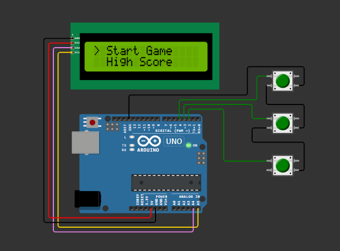

# 🏎️ Arduino Racing Game with LCD & Push Buttons

An interactive **racing game built using Arduino Uno**, featuring a **16x2 LCD display** and **push buttons** for controls.  
The game includes a **menu system**, **real-time gameplay**, and **high-score tracking**, all implemented without external libraries beyond the standard Arduino LCD library.

---

## 📌 Features

- 🎮 Menu-driven interface
  - Start Game
  - View High Score
- 🏁 Real-time racing gameplay logic
- 🔘 Button-based controls (Up / Down / Select)
- 📟 16x2 LCD display output
- 🏆 High score tracking during runtime
- ⚡ Optimized for Arduino Uno (low memory usage)

---

## 🧰 Hardware Components Used

- Arduino Uno  
- 16x2 LCD Display  
- 3 × Push Buttons  
- 10kΩ Potentiometer (for LCD contrast)  
- Breadboard & Jumper Wires  

---

## 🔌 Circuit Overview

- LCD connected in **4-bit mode**
- Push buttons connected to Arduino digital pins with pull-down logic
- Powered via USB

- The following diagram shows the complete hardware connections between the Arduino Uno, LCD display, and push buttons.

---

## 🛠️ Software & Tools

- Arduino IDE
- C / Embedded C
- LiquidCrystal library

---

## 🚀 How It Works

1. On power-up, the LCD displays a **menu screen**
2. Buttons allow navigation between options
3. Game logic updates obstacles and player position
4. Collision detection ends the game
5. Score is calculated and stored as **high score (runtime)**

---

## 📂 Project Structure
Arduino-Racing-Game/
│
├── racing_game.ino
├── circuit_diagram.png
└── README.md

---

## 📈 Future Improvements

- EEPROM-based permanent high score storage
- Sound effects using a buzzer
- Level difficulty scaling
- OLED display upgrade

---

## 👤 Author

**Guna Sekhar**  
B.Tech ECE (2025)  
Interested in Embedded Systems, IoT & Software Development

---

## ⭐ If you like this project

Give it a ⭐ and feel free to fork or improve it!

